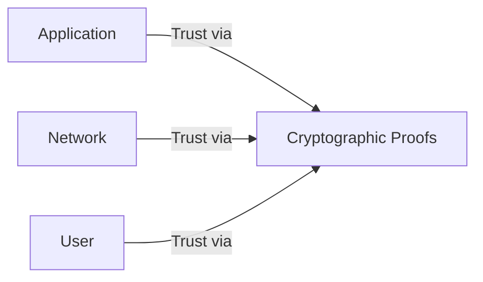
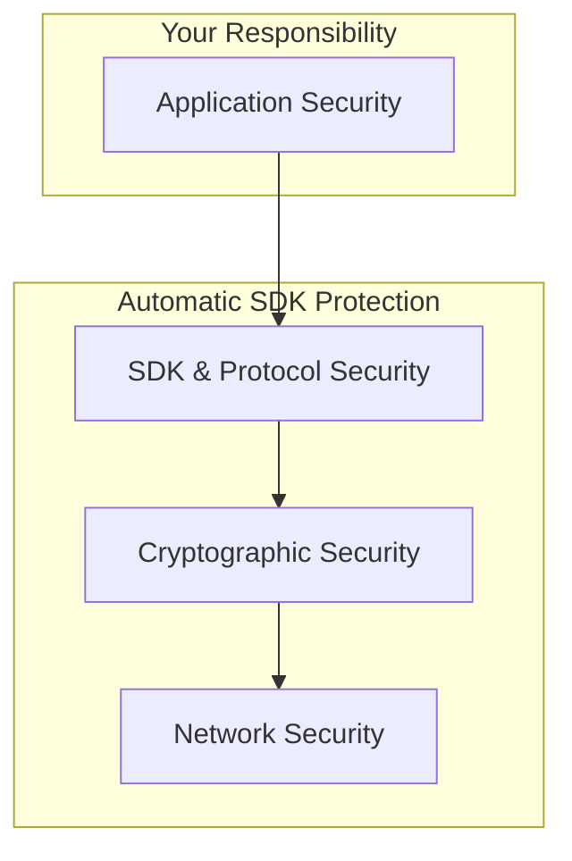

# 🛡️ Security Model

> **🔧 Hands-on Learning:** Security concepts are demonstrated in all [Academy Examples](../examples/overview.md)

## What You'll Learn

Now that you understand the [architecture](system-overview.md) and have built [working applications](../examples/overview.md), let's dive into the **Self SDK Security Model**. This page explains the threat models, security guarantees, and cryptographic integrity that make Self SDK a foundation for secure, decentralized applications.

**🎯 Learning Goals:**
- Understand the "Zero Trust" architecture of Self SDK
- Explore threat models for network, cryptographic, and application attacks
- Learn about the defense-in-depth security layers
- See how cryptographic guarantees protect against real-world attacks
- Connect security theory to the examples you've built

## 🌐 Zero Trust Architecture

The Self SDK is built on a **Zero Trust** model, meaning no component is trusted by default. Trust is established through **cryptographic proof**, not network location or identity claims.



**🔑 Core Principles:**
- **Verify Explicitly**: Every message, connection, and credential is cryptographically verified
- **Least Privilege Access**: Components only have access to necessary resources
- **Assume Breach**: Design for security even if parts of the system are compromised

**Your Experience with Zero Trust:**
- **Connection Handshake**: You didn't trust the other party until a cryptographic handshake was complete
- **Credential Verification**: You didn't trust a claim until you verified its Ed25519 signature
- **Message Authentication**: Every message was automatically authenticated with a signature

## 🛡️ Defense in Depth Security Layers

The Self SDK provides multiple layers of security, creating a robust defense against attacks:



### 1. Application Security (Your Code)

**You are responsible for securing your application logic.**

**Key Responsibilities:**
- **Input Validation**: Sanitize all inputs to prevent injection attacks
- **Business Logic Controls**: Enforce access control for application features
- **Secure Configuration**: Manage API keys and environment variables securely
- **Dependency Management**: Keep third-party libraries updated
- **User Management**: Securely handle user authentication for your application

**Example from [Integration Patterns](integration-patterns.md):**
```go
// Your application should validate user permissions
func requiresRole(role string, next http.Handler) http.HandlerFunc {
    return func(w http.ResponseWriter, r *http.Request) {
        userRole := getUserRole(r)
        if userRole != role {
            http.Error(w, "Forbidden", http.StatusForbidden)
            return
        }
        next.ServeHTTP(w, r)
    }
}
```

### 2. SDK & Protocol Security (Automatic)

The Self SDK automatically handles protocol-level security.

**Key Protections:**
- **[MLS Encryption](../concepts/message-layer-security.md)**: End-to-end encryption for all messages
- **[Forward Secrecy](../concepts/message-layer-security.md#forward-secrecy)**: Past messages remain secure if keys are compromised
- **[Post-Compromise Security](../concepts/message-layer-security.md#post-compromise-security)**: Automatic healing after a breach
- **[Credential Protocol](../examples/credentials.md)**: W3C-compliant secure credential exchange
- **[Connection Protocol](../examples/connections.md)**: Secure key exchange and mutual authentication

### 3. Cryptographic Security (Mathematical)

The mathematical foundation of all security guarantees.

**Key Primitives:**
- **[Ed25519 Signatures](../concepts/cryptographic-foundations.md#ed25519-digital-signatures)**: Unforgeable proof of identity and message origin
- **[X25519 Key Exchange](../concepts/cryptographic-foundations.md#x25519-key-exchange)**: Secure generation of shared encryption keys
- **[SHA-2 Hashing](../concepts/cryptographic-foundations.md#sha-2-hashing)**: Data integrity and tamper detection

### 4. Network Security (Infrastructure)

The Self Network provides secure routing and infrastructure.

**Key Features:**
- **TLS 1.3 Encryption**: All communication with network relays is encrypted
- **Relay Authentication**: Network nodes are authenticated
- **DDoS Protection**: Infrastructure-level filtering and rate limiting
- **Decentralized Routing**: No single point for message interception

## 🎯 Threat Modeling & Mitigations

The Self SDK is designed to protect against a wide range of attacks.

### Network Attack Vectors & Defenses

| Threat Vector | Attack Description | ✅ Self SDK Mitigation |
|---------------|--------------------|------------------------|
| **Man-in-the-Middle (MITM)** | Attacker intercepts and modifies communication | **End-to-End Encryption (MLS)**. Attacker cannot read or modify messages without cryptographic keys. |
| **Eavesdropping** | Attacker listens to network traffic | **End-to-End Encryption (MLS)**. All message content is encrypted. |
| **Replay Attack** | Attacker resends valid messages | **Nonces & Timestamps**. Protocols include freshness checks to prevent message reuse. |
| **Denial of Service (DoS)** | Attacker floods network or service | **Decentralized Infrastructure**. No single point of failure. **Rate Limiting** at network and application levels. |
| **Traffic Analysis** | Attacker analyzes message patterns | **Metadata Protection**. Message content and sender/receiver relationships are protected. Optional proxy routing adds further protection. |

**Real-world scenario: Cafe Wi-Fi Attack**
An attacker on public Wi-Fi cannot intercept your Self SDK communication because it is end-to-end encrypted from your device to the recipient's device. They see encrypted traffic, but cannot read messages or impersonate you.

### Cryptographic Attack Vectors & Defenses

| Threat Vector | Attack Description | ✅ Self SDK Mitigation |
|---------------|--------------------|------------------------|
| **Key Compromise** | Attacker steals a user's private key | **Forward Secrecy & Post-Compromise Security**. Stolen keys cannot decrypt past messages. MLS protocol automatically "heals" by generating new keys. |
| **Signature Forgery** | Attacker creates fake signatures | **Ed25519 Security**. Mathematically impossible to forge signatures without the private key. |
| **Quantum Attack** | Future quantum computers breaking encryption | **Algorithm Agility**. SDK is designed for post-quantum algorithm migration. Current hybrid approaches can be implemented. |
| **Side-Channel Attack** | Attacker analyzes timing or power usage | **Ed25519 & X25519** algorithms are designed with side-channel resistance. |

**Real-world scenario: Stolen Laptop**
If a laptop with a Self SDK account is stolen, the attacker gains access to the current keys. However, they **cannot decrypt past messages** due to forward secrecy. When the user pairs a new device, the MLS protocol automatically removes the compromised device and generates new keys for the group.

### Application Attack Vectors & Defenses

| Threat Vector | Attack Description | ✅ Self SDK Mitigation |
|---------------|--------------------|------------------------|
| **Phishing & Impersonation** | Attacker tricks user into connecting | **Cryptographic Identity**. Connections are to a specific DID, not a mutable username. Verified credentials can add further trust. |
| **Malicious Application** | App using Self SDK has vulnerabilities | **Your Responsibility**. The SDK is secure, but you must secure your application logic (input validation, access control). |
| **Data Exfiltration** | Attacker exploits bug to steal data | **Encrypted Storage**. All data at rest is encrypted. **Least Privilege** design minimizes data access. |
| **Social Engineering** | Attacker tricks user into revealing secrets | **User Education**. Cryptography cannot prevent users from being deceived. Applications should provide clear UI and warnings. |

**Real-world scenario: Malicious Credential Issuer**
An attacker sets up a fake "university" and issues fake diplomas. While the credential signature is valid, the **issuer's identity is not trustworthy**. Your application should implement a trust model, only accepting credentials from known, verified issuers.

## 🔐 Cryptographic Guarantees

The Self SDK provides the following mathematical guarantees:

| Guarantee | How It's Achieved | Your Benefit in Examples |
|-----------|-------------------|--------------------------|
| **Confidentiality** | MLS End-to-End Encryption | Your [chat messages](../examples/chat.md) were unreadable by anyone except the recipient. |
| **Authenticity** | Ed25519 Digital Signatures | When you received a connection request, you knew exactly who sent it. |
| **Integrity** | SHA-2 Hashing & Signatures | [Credentials](../examples/credentials.md) could not be tampered with after being issued. |
| **Non-Repudiation**| Ed25519 Digital Signatures | An issuer cannot deny having issued a credential they signed. |
| **Forward Secrecy**| Ephemeral X25519 Keys in MLS | If one message key was compromised, past and future messages remained secure. |
| **Post-Compromise Security** | MLS Ratcheting Mechanism | If a device was compromised, the group could recover securely. |

## プライバシー by Design

Privacy is a core design principle of the Self SDK.

### Data Minimization
The SDK and network are designed to collect the minimum amount of data necessary:
- **No User Profiles**: The Self Network does not store user profiles or personal information.
- **Routing Metadata Only**: Network relays only see encrypted blobs and routing information.
- **Local Storage**: All sensitive data is stored on the user's device, encrypted.

### User Control & Consent
You've seen this in action in your examples:
- **Connections Require Consent**: No one can message you without first establishing a connection, which requires your approval.
- **Selective Disclosure**: You choose which credentials to share in a presentation.
- **Account Deletion**: Users can delete their accounts, permanently removing their identity and keys.

### Anonymous Communication
While the examples use direct identity, the SDK supports patterns for privacy:
- **Pseudonymous Identities**: Create DIDs that are not linked to real-world identity.
- **Connection-based Trust**: Trust is established per-connection, without needing global identity.
- **Optional Proxy Routing**: Hide IP addresses and traffic patterns from network observers.

## 🎓 What Just Happened? Security Mastery Achieved

### ✅ **Security Model Understanding**

You now understand the deep security architecture of the Self SDK:

- **🛡️ Zero Trust Model**: Trust is earned through cryptography, not assumed.
- **🔐 Defense in Depth**: Multiple layers of protection from network to application.
- **🎯 Threat Modeling**: How Self SDK protects against real-world attacks.
- **🔒 Cryptographic Guarantees**: The mathematical promises that underpin the system.
- **🕵️ Privacy by Design**: How user privacy is protected at every layer.

### ✅ **Your Examples in a Security Context**

Every example you built was an exercise in applied security:

| Your Example | Security Principle Demonstrated | Key Protection |
|--------------|---------------------------------|----------------|
| **[Setup](../examples/setup.md)** | Cryptographic Identity | Generated unforgeable Ed25519 keypair |
| **[Connections](../examples/connections.md)** | Zero Trust Handshake | Established secure channel before communication |
| **[Credentials](../examples/credentials.md)** | Verifiable Claims | Used Ed25519 signatures to prove authenticity |
| **[Chat](../examples/chat.md)** | Confidential Communication | Sent end-to-end encrypted messages with forward secrecy |
| **[Integration](integration-patterns.md)**| Production Security | Implemented secure storage and access control |

## 📚 Next Steps

You have now completed the entire **Architecture** section!

1. **✅ [System Overview](system-overview.md)**
2. **✅ [Integration Patterns](integration-patterns.md)**
3. **✅ [Security Model](security-model.md)**

With this knowledge, you are ready to:
- **🚀 Build Production Applications**: Use the [advanced examples](../examples/advanced.md) as a starting point.
- **Deepen Your Knowledge**: Re-read the [concepts docs](../concepts/overview.md) with your new architectural understanding.
- **Contribute**: Help improve the SDK with your security expertise.

## 💡 Key Takeaways

- **Security is Automatic**: The SDK handles complex cryptography and protocols for you.
- **You Are Part of the Model**: Your application's security is a critical layer.
- **Cryptography Provides Proof**: Trust is based on mathematical guarantees, not promises.
- **Design for Failure**: The system is designed to be secure even when components are compromised.
- **Privacy is Paramount**: User control and data minimization are built in.

The Self SDK provides a powerful foundation, but a truly secure system requires both a secure SDK and a securely written application. You are now equipped with the knowledge to build both.

**Ready to build the future of secure, decentralized applications? 🛡️**

## Related Documentation

- [Cryptographic Foundations](../concepts/cryptographic-foundations.md) - Mathematical security basis
- [System Overview](system-overview.md) - Complete architecture context
- [Integration Patterns](integration-patterns.md) - Secure implementation patterns

## Next Steps

- Review [Cryptographic Concepts](../concepts/cryptographic-foundations.md) for technical details
- Explore [Advanced Examples](../examples/advanced.md) for security implementations 
