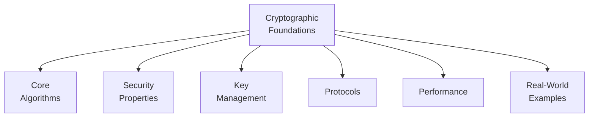

# Cryptographic Foundations

> **Hands-on Learning:** These concepts underpin all [Academy Examples](../examples/overview.md)

## What You'll Learn

By exploring this section, you will gain a comprehensive understanding of the cryptographic backbone of the Self SDK.

- **Core Algorithms:** The fundamental building blocks like `Ed25519` and `X25519`.
- **Security Properties:** How we achieve confidentiality, integrity, and authenticity.
- **Key Management:** Best practices for handling cryptographic keys securely.
- **High-Level Protocols:** The role of cryptography in messaging and connections.
- **Performance:** The efficiency and speed of our chosen cryptographic methods.
- **Practical Application:** How to use these concepts in real-world code.

---
  
Self builds on proven cryptographic primitives to provide secure, decentralized identity and messaging. 

This section explains the mathematical foundations that make everything work - from your first account creation to complex credential exchanges.

Our cryptographic foundations are broken down into the following sections:

- **[Core Algorithms](cryptographic-foundations/core-algorithms.md):** Learn about the fundamental cryptographic algorithms used in Self, including `Ed25519` for digital signatures and `X25519` for key exchange.
- **[Security Properties](cryptographic-foundations/security-properties.md):** Understand how Self achieves key security properties like confidentiality, integrity, non-repudiation, and authenticity.
- **[Key Management](cryptographic-foundations/key-management.md):** Explore the patterns used for key generation, storage, and distribution to ensure the security of cryptographic keys.
- **[Protocols](cryptographic-foundations/protocols.md):** Dive into the cryptographic protocols that power Self, such as Message Layer Security (MLS) and secure connection establishment.
- **[Performance](cryptographic-foundations/performance.md):** Review the performance characteristics of the cryptographic algorithms to understand their efficiency.
- **[Real-World Examples](cryptographic-foundations/real-world-examples.md):** See how these cryptographic concepts are applied in practical, real-world scenarios within Self.
