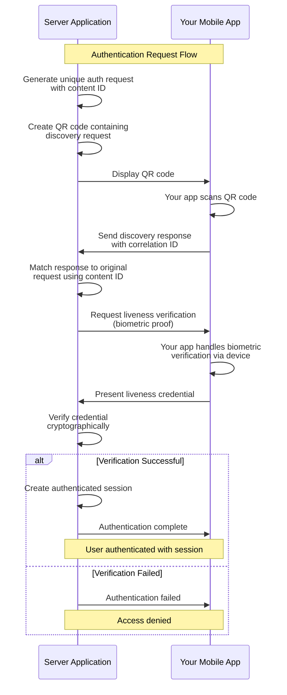

# Authentication

> **🎯 What you'll learn:** How to build production-ready, passwordless authentication using Self's decentralized identity and biometric verification.

Self's authentication solution replaces traditional username/password systems with cryptographic identity verification and biometric security.

Users authenticate by scanning a QR code with your mobile application and providing biometric confirmation - no passwords, no personal data storage, no security vulnerabilities from credential breaches.

## Architecture Overview

Self authentication operates as a **distributed security model** across two applications:

**Server-Side Application** _(Your Backend)_

- Generates unique QR codes for each authentication request
- Manages request-response correlation using cryptographic content IDs
- Verifies credentials without handling sensitive data
- Creates authenticated sessions after successful verification

**Mobile Application** _(Your Mobile App)_  

- Integrates Self SDK for QR code scanning and connection establishment
- Handles all biometric operations locally and privately using device capabilities
- Presents verifiable credentials without exposing private keys
- Maintains complete control over the user's decentralized identity

This approach eliminates traditional attack vectors while providing enterprise-grade security with a seamless user experience.

## Complete Authentication Flow

Experience the full authentication workflow with our production-ready example:

### Ready-to-Run Authentication System

**[Self Authentication Demo](../examples/server/auth-system/)** - Complete production implementation featuring:

- QR code generation with automatic expiration
- Real-time request tracking and correlation  
- Biometric liveness verification
- Session management with configurable timeouts
- Clean integration interface for production use

**Try it now:**
```bash
cd examples/server/auth-system
SELF_AUTH_STORAGE_KEY="$(openssl rand -base64 32)" go run cmd/server/main.go
# Open http://localhost:8081 and scan the QR code with the Self Developer App!
```

> **🔧 Testing:** While mobile SDK examples are in development, you can test the authentication flow using the **[Self Developer App](https://www.joinself.com/developers/developers)** - a ready-to-use mobile app for testing Self authentication backends.

### How the Authentication Flow Works

The Self authentication process involves four main phases that establish a secure connection, verify user identity through biometrics, and create an authenticated session. Each phase uses cryptographic content IDs to ensure perfect correlation between requests and responses.

<details>
<summary><strong>📊 View Complete Flow Diagram</strong></summary>



</details>

**1. QR Code Generation & Content ID Mapping**
   
   Your server creates a unique discover request embedded on a QR code with a trackable content ID:

<div data-github-embed="https://github.com/joinself/academy/blob/main/examples/server/auth-system/internal/auth/service.go#L279-L313"
     data-style="github-dark-dimmed"
     data-show-border="true"
     data-show-line-numbers="true"
     data-show-file-meta="true"
     data-show-full-path="true"
     data-show-copy="true"></div>

**2. User Connection & Discovery Response**
   
   When users scan the QR code with their mobile app, the SDK automatically correlates their response:

<div data-github-embed="https://github.com/joinself/academy/blob/main/examples/server/auth-system/internal/auth/service.go#L366-L410"
     data-style="github-dark-dimmed"
     data-show-border="true"
     data-show-line-numbers="true"
     data-show-file-meta="true"
     data-show-full-path="true"
     data-show-copy="true"></div>

**3. Biometric Verification Request**
   
   Once connected, the server requests liveness verification for authentication:

<div data-github-embed="https://github.com/joinself/academy/blob/main/examples/server/auth-system/internal/auth/service.go#L415-L461"
     data-style="github-dark-dimmed"
     data-show-border="true"
     data-show-line-numbers="true"
     data-show-file-meta="true"
     data-show-full-path="true"
     data-show-copy="true"></div>

**4. Credential Verification & Session Creation**
   
   The server verifies the biometric proof and creates an authenticated session:

<div data-github-embed="https://github.com/joinself/academy/blob/main/examples/server/auth-system/internal/auth/service.go#L462-L520"
     data-style="github-dark-dimmed"
     data-show-border="true"
     data-show-line-numbers="true"
     data-show-file-meta="true"
     data-show-full-path="true"
     data-show-copy="true"></div>

> **📖 Full Implementation:** See the complete backend implementation with HTTP server, UI, and production-ready architecture at **[examples/server/auth-system/](https://github.com/joinself/academy/blob/main/examples/server/auth-system/)**

## Request-Response Correlation System

A critical aspect of Self authentication is the sophisticated correlation system that tracks requests through their complete lifecycle using cryptographic content IDs.

### Content ID-Based Tracking

The Self SDK provides automatic correlation between QR codes, user responses, and authentication completion using unique content identifiers embedded in each message.

### Three-Phase Correlation Process

**Phase 1: QR Code → Discovery Response**

- QR code contains discovery request with unique content ID
- Your mobile app scans QR and responds with discovery response containing correlation ID
- Server matches response to original request using content ID

**Phase 2: Discovery → Credential Request**  

- Server sends liveness verification request to connected user
- New content ID generated for credential request
- Auth request updated with credential request ID for tracking

**Phase 3: Credential Request → Authentication Result**

- User provides biometric proof via credential presentation response
- Server correlates credential response to original credential request
- Authentication completed and session created upon successful verification

This multi-phase correlation ensures perfect request isolation and enables concurrent authentication flows without interference.

## Session Management Approaches

Our authentication system supports flexible session management:

**Stateless Authentication** _(Demonstrated in example)_

- No persistent server-side sessions
- Each authentication creates temporary result data
- Perfect for demos and simple applications
- Automatic cleanup after authentication completion

**Stateful Sessions** _(Production pattern)_

- Create persistent session objects after authentication
- Map sessions to user DIDs and connection IDs  
- Implement configurable session timeouts and cleanup
- Enable protected routes and user state management

## Building Your Mobile App

You can build your own mobile application with Self authentication capabilities using our mobile SDKs:

### Mobile SDK Integration _(Coming Soon)_

While mobile examples are being finalized, you can test your authentication backend immediately:

**[Self Developer App](https://www.joinself.com/developers/developers)** - A complete mobile testing tool that:

- Scans authentication QR codes from your backend
- Handles the complete authentication flow  
- Provides biometric verification capabilities
- Works with any Self-enabled authentication backend
- Perfect for development and testing phases

> **💡 Production Ready:** The backend authentication system is production-ready. Once mobile SDK examples are available, you can seamlessly integrate Self authentication into your own mobile applications.


## Core Concepts

Self authentication builds on fundamental cryptographic and identity principles:

- **[Decentralized Identity](../concepts/decentralized-identity.md)**: The foundation of Self's authentication system
- **[Secure Connections](../concepts/secure-connections.md)**: How cryptographic communication channels are established  
- **[Verifiable Credentials](../concepts/verifiable-credentials.md)**: The standard for presenting identity claims


## Next Steps

- **[Identity Verification](./identity-verification.md)**: Issue your own credentials to enhance authentication
- **[Chat & Messaging](../examples/chat.md)**: Build secure communication with authenticated users 
