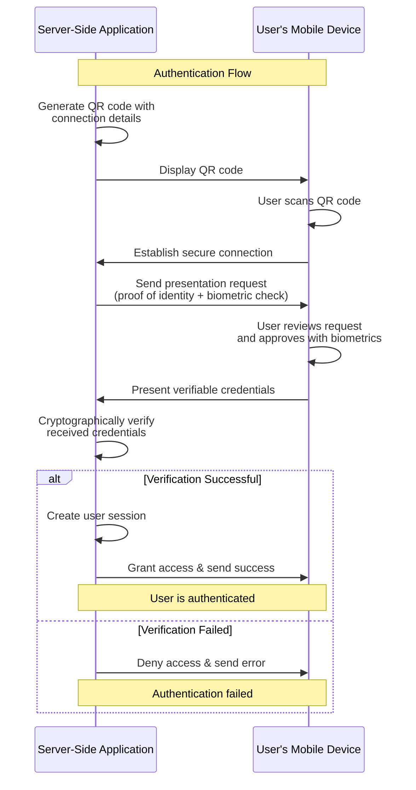

# Authentication

> **🎯 What you'll learn:** How to replace traditional logins with secure, passwordless authentication using verifiable credentials for both server-side and mobile applications.

Self's authentication solution enables you to build secure, passwordless login experiences. 

Instead of relying on vulnerable usernames and passwords, users authenticate using their unique SelfID, backed by biometrics. 

This approach provides higher security and a more seamless user experience.

## Architecture Overview

Self's authentication system operates as a **two-application workflow** that fundamentally reimagines how authentication works:

**Server-Side Application** _(Your Backend)_

- Maintains control over access decisions and session management
- Never handles or stores sensitive or biometric data
- Cryptographically verifies credentials without touching private keys

**Mobile Application** _(User's Device)_

- Keeps all sensitive operations local and private
- Uses device-level biometric security for user approval
- Maintains full control over the user's decentralized identity

This distributed security model eliminates traditional vulnerabilities like password breaches, credential stuffing, and server-side biometric storage risks. 

Users get a seamless experience while developers get enterprise-grade security without the complexity of managing sensitive authentication data.

## How It Works

The typical authentication flow involves these steps:

1. **Connection**: The user scans a QR code to establish a secure connection with your application.
2. **Presentation Request**: Your server-side application requests proof of identity from the user.
3. **Credential Presentation**: The user approves the request on their mobile device and presents their verifiable credentials.
4. **Credential Verification**: Your server-side application cryptographically verifies the received credentials.
5. **Session Establishment**: Upon successful verification, the user is granted access and a session is created.

<strong>📊 View Authentication Flow Diagram</strong>

## See it in Action

Experience Self authentication with our ready-to-use demo applications. We provide complete implementations for both mobile and server components that you can run immediately.

### Demo Applications

**Mobile Demos**

- **[Android Demo App](https://github.com/joinself/self-sdk-examples/tree/main/android/SelfDemo)**: Complete Android implementation with all authentication flows
- **[iOS Demo App](https://github.com/joinself/self-sdk-examples/tree/main/ios/Example)**: Native iOS implementation with biometric integration

**Server Demo**

- **[Golang Server Demo](https://github.com/joinself/self-sdk-examples/tree/main/golang)**: Complete backend implementation with QR generation, connection handling, and credential verification

> **💡 Note:** These demo applications are fully interoperable - the mobile demos work seamlessly with the server demos and all documentation examples throughout this academy. You can mix and match any server implementation with any mobile app.

### Quick Demo Video

Watch Self authentication in action - from QR code scan to biometric approval in seconds:

_[Quick demo video showing the complete authentication flow coming soon]_

### Get Started Now

1. **Choose your platform**: Pick from Android, iOS, or Golang server examples
2. **Run the demo**: Follow the README instructions in any example directory
3. **See it work**: Experience Self authentication firsthand
4. **Customize**: Adapt the examples to your application's needs

## Related Examples

### Server-Side Implementation

#### QR Code Connection

Generate QR codes that users can scan to establish secure connections:

#### Credential Presentation Request

Request and verify user credentials for authentication:

### Mobile Implementation

#### Account Setup

_[View full example](https://github.com/joinself/academy/tree/main/examples/mobile/android/00_setup/01_new_account/)_

Create a new Self identity for users within your mobile app.

#### Credential Presentation

_[View full example](https://github.com/joinself/academy/tree/main/examples/mobile/android/02_credentials/)_

Handle authentication requests with built-in UI components that manage the secure presentation of credentials to your application.

## Core Concepts

Authentication is achieved by verifying control over a decentralized identifier (DID) and exchanging verifiable credentials. To understand the foundations, please review these concepts:

- **[Decentralized Identity](../concepts/decentralized-identity.md)**: The core paradigm behind Self's authentication.
- **[Secure Connections](../concepts/secure-connections.md)**: How two parties establish a trusted communication channel.
- **[Verifiable Credentials](../concepts/verifiable-credentials.md)**: The data format used to prove identity attributes.

## Next Steps

- **[Identity Verification](./identity-verification.md)**: Learn how to issue your own credentials to verify user identities.
- **[Chat & Messaging](https://github.com/joinself/academy/tree/main/examples/chat.md)**: Build secure, in-app communication channels with authenticated users. 
