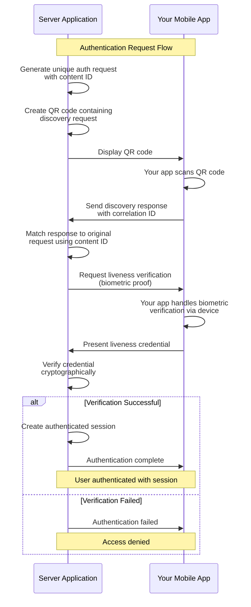

# Authentication

> **🎯 What you'll learn:** How to build production-ready, passwordless authentication using Self's decentralized identity and biometric verification.

Self's authentication solution replaces traditional username/password systems with cryptographic identity verification and biometric security.

Users authenticate by scanning a QR code with your mobile application and providing biometric confirmation - no passwords, no personal data storage, no security vulnerabilities from credential breaches.

## Architecture Overview

Self authentication operates as a **distributed security model** across two applications:

**Server-Side Application** _(Your Backend)_

- Generates unique QR codes for each authentication request
- Manages request-response correlation using cryptographic content IDs
- Verifies credentials without handling sensitive data
- Creates authenticated sessions after successful verification

**Mobile Application** _(Your Mobile App)_  

- Integrates Self SDK for QR code scanning and connection establishment
- Handles all biometric operations locally and privately using device capabilities
- Presents verifiable credentials without exposing private keys
- Maintains complete control over the user's decentralized identity

This approach eliminates traditional attack vectors while providing enterprise-grade security with a seamless user experience.

## Complete Authentication Flow

The Self authentication process involves four main phases that establish a secure connection, verify user identity through biometrics, and create an authenticated session. 

Each phase uses cryptographic content IDs to ensure perfect correlation between requests and responses.

<strong>📊 View Complete Flow Diagram</strong>

## Implementation Guides

### Server Implementation

Complete backend implementation guide covering:

- Detailed authentication flow breakdown
- Request-response correlation system  
- Code examples and technical integration
- Session management patterns

[Check the implementation details](./authentication/server-implementation.md)

### Mobile Implementation

Mobile SDK integration guide covering:

- Platform-specific examples (iOS/Android)
- SDK integration patterns
- Testing with Self Developer App
- Production mobile app considerations

[Check the implementation details](./authentication/mobile-implementation.md)

## Core Concepts

Self authentication builds on fundamental cryptographic and identity principles:

- **[Decentralized Identity](../concepts/decentralized-identity.md)**: The foundation of Self's authentication system
- **[Secure Connections](../concepts/secure-connections.md)**: How cryptographic communication channels are established  
- **[Verifiable Credentials](../concepts/verifiable-credentials.md)**: The standard for presenting identity claims

## Next Steps

Ready to implement Self authentication? Follow our implementation guides:

- **[Server Implementation](./authentication/server-implementation.md)**: Build your authentication backend
- **[Mobile Implementation](./authentication/mobile-implementation.md)**: Integrate authentication into your mobile app  
- **[Conclusions & Best Practices](./authentication/conclusions.md)**: Production deployment guide and best practices

**Extend your authentication system:**

- **[Identity Verification](./identity-verification.md)**: Issue custom credentials to authenticated users
- **[Chat & Messaging](../examples/chat.md)**: Build secure communication with authenticated users 
