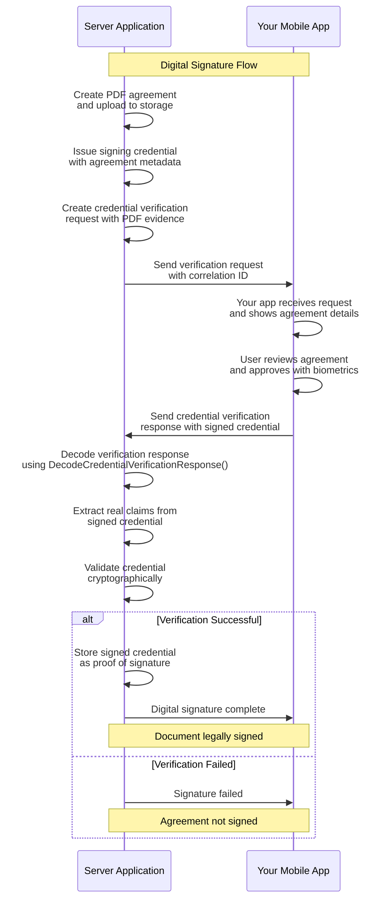

# Digital Signatures

> ****What you will learn:** What you'll learn:** How to build production-ready, biometrically-backed digital signatures using Self's verifiable credentials and real credential verification response processing.

Self's digital signature solution creates legally binding signatures through verifiable credentials that represent agreements. Users sign documents by accepting credentials on their mobile device with biometric authentication, providing cryptographic proof of agreement without traditional electronic signature vulnerabilities.

In this section you will see how to build a digital signing workflow where users can sign documents by scanning a QR code with your mobile application and providing biometric confirmation - no passwords, no centralized signature storage, no security vulnerabilities from signature forgery.

## Architecture Overview

Self digital signatures operate as a **distributed signing model** across two applications:

**Server-Side Application**

- Creates PDF agreements and uploads them to secure storage
- Issues signing credentials with agreement metadata and evidence
- Sends credential verification requests with document evidence
- Processes real credential verification responses and extracts claims
- Validates signed credentials as proof of digital signatures

**Mobile Application**

- Integrates Self SDK for QR code scanning and connection establishment
- Handles all biometric operations locally and privately using device capabilities
- Reviews agreement details and approves with biometric authentication
- Maintains complete control over the user's digital signature credentials

This approach eliminates traditional signature forgery risks while providing legally binding digital signatures with a seamless user experience.

## Digital Signature Flow

The Self digital signature process involves five main phases that establish a secure connection, create signing credentials, verify user approval through biometrics, and process real credential verification responses.

Each phase uses cryptographic content IDs to ensure perfect correlation between requests and responses.

<strong>**Overview:** View Complete Flow Diagram</strong>

## Implementation Guides

### Server

Complete backend implementation guide covering:

- Detailed digital signature flow breakdown
- Credential issuance with agreement metadata
- Real credential verification response processing
- Claims extraction and validation patterns

[Check the implementation details](./digital-signatures/server-implementation.md)

### Mobile

Mobile SDK integration guide covering:

- Platform-specific examples (iOS/Android)
- Agreement review and approval flows
- Biometric signature confirmation
- Production mobile app considerations

[Check the implementation details](./digital-signatures/mobile-implementation.md)

## Core Concepts

Self digital signatures build on fundamental cryptographic and credential principles:

- **[Verifiable Credentials](../concepts/verifiable-credentials.md)**: The foundation of Self's digital signature system
- **[Credential Presentation Patterns](../concepts/credential-presentation-patterns.md)**: How credential verification requests are structured
- **[Cryptographic Foundations](../concepts/cryptographic-foundations.md)**: The cryptographic principles that ensure signature integrity

## Next Steps

Ready to implement Self digital signatures? 
Follow our implementation guides:

- **[Server Implementation](./digital-signatures/server-implementation.md)**: Build your digital signature backend
- **[Mobile Implementation](./digital-signatures/mobile-implementation.md)**: Integrate signing into your mobile app  
- **[Conclusions & Best Practices](./digital-signatures/conclusions.md)**: Production deployment guide and best practices

**Extend your digital signature system:**

- **[Authentication](./authentication.md)**: Authenticate users before allowing document signing
- **[Identity Verification](./identity-verification.md)**: Verify user identity before signature approval
- **[Multi-Party Signing](../examples/advanced.md)**: Build workflows for multiple signers on single documents
