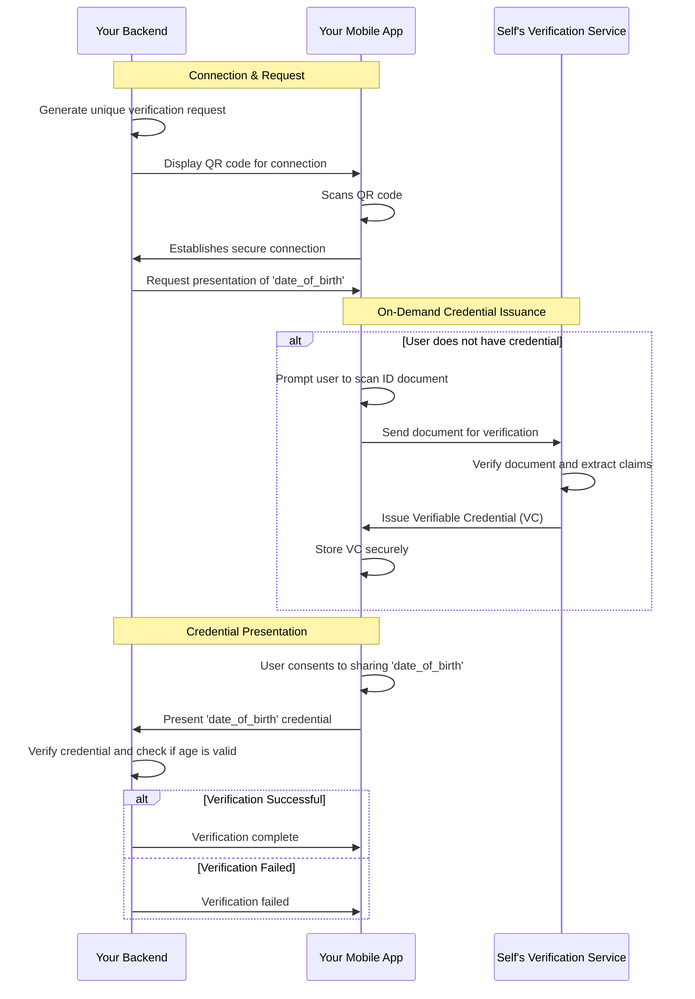

# Identity Verification

> **🎯 What you'll learn:** How to build a production-ready Know Your Customer (KYC) workflow for age verification using Self's verifiable credentials and mobile document capture.

Self's identity verification solution allows you to confirm user attributes like age by requesting and verifying credentials derived from official documents. 

The process leverages Self's backend services to verify documents and issue credentials directly to a user's mobile device, enhancing trust and compliance without requiring you to store sensitive personal data.

This guide uses an **age verification** scenario as a practical example of a KYC process.

## Architecture Overview

The identity verification solution involves three key components working together in a secure, distributed model:

**1. Your Backend Application**

- Initiates the verification process by requesting a credential with a specific claim (e.g., "date of birth").
- Generates a QR code to establish a secure connection with the user's mobile app.
- Receives and cryptographically verifies the credential presented by the user's app.
- Never handles raw identity documents, only the verifiable credential.

**2. Your Mobile Application (with Self SDK)**

- Scans the QR code to connect with your backend.
- If the user doesn't have the required credential, the SDK manages the issuance process.
- Guides the user to capture their identity document (e.g., passport, driver's license).
- Securely stores the issued verifiable credentials on the device.
- Handles user consent and presents the credential to your backend.

**3. Self's Verification Service**

- Receives the encrypted document from the user's mobile app.
- Performs all verification and authenticity checks while the document resides only in-memory.
- Extracts the required data (claims) from the document.
- Issues a signed, verifiable credential back to the user's mobile app.
- Wipes the document from memory immediately after the credential is sent.

This model ensures that you can trust the claims presented by the user without ever handling or storing the underlying sensitive documents yourself.

## Complete Verification Flow

The age verification process begins when your service requests information from a user. If the user does not yet have the required credential, the Self SDK initiates an on-demand issuance flow.

<strong>📊 View Complete Flow Diagram</strong>

## Implementation Guides

### Server Implementation

A complete backend implementation guide covering:

- Detailed verification flow breakdown.
- Request-response correlation system.
- Code examples for requesting and verifying credentials.

[Check the implementation details](./identity-verification/server-implementation.md)

### Mobile Implementation

A mobile SDK integration guide covering:

- Platform-specific examples (iOS/Android) for document capture.
- Handling user consent and data extraction.
- Presenting credentials to the backend.

[Check the implementation details](./identity-verification/mobile-implementation.md)

## Core Concepts

Self's identity verification builds on fundamental cryptographic and identity principles:

- **[Verifiable Credentials](../concepts/verifiable-credentials.md)**: The standard for presenting identity claims.
- **[Secure Connections](../concepts/secure-connections.md)**: How cryptographic communication channels are established.  
- **[Decentralized Identity](../concepts/decentralized-identity.md)**: The foundation of Self's identity system.

## Next Steps

Ready to implement identity verification? Follow our implementation guides:

- **[Server Implementation](./identity-verification/server-implementation.md)**: Build your verification backend.
- **[Mobile Implementation](./identity-verification/mobile-implementation.md)**: Integrate document capture into your mobile app.
- **[Conclusions & Best Practices](./identity-verification/conclusions.md)**: Production deployment guide and best practices.

**Extend your verification system:**

- **[Authentication](./authentication.md)**: Combine identity verification with passwordless login.
- **[Digital Signatures](./digital-signatures.md)**: Enable users to sign documents after verifying their identity. 
