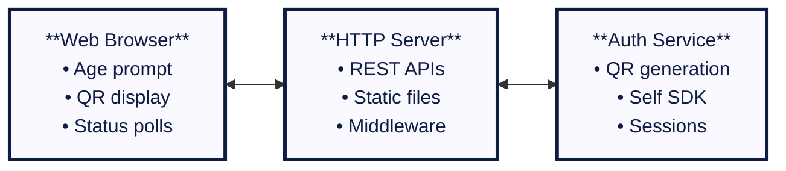

# Server Implementation

> **🎯 What you'll learn:** How to implement a production-ready age verification system by requesting and verifying verifiable credentials from a user's device.

This guide covers the technical implementation of an identity verification service from the backend's perspective. The process builds upon the principles of the **[authentication server implementation](../authentication/server-implementation.md)** but focuses on requesting and verifying specific claims from a user.

## Quick Start

Experience the complete age verification workflow with our **[production-ready age verifier](https://github.com/joinself/academy/blob/main/examples/solutions/age-verifier/)** example featuring:

- Full web interface with "I'm 18 or older" button workflow
- Date of birth credential requests and validation with zero-knowledge proofs
- Automatic age calculation and access control
- Privacy-preserving verification with minimal data exposure
- Real-time status updates and graceful error handling
- Production-ready architecture with logging and shutdown handling

**Try it now:**
```bash
cd examples/solutions/age-verifier
SELF_AUTH_STORAGE_KEY="$(openssl rand -base64 32)" go run cmd/server/main.go
# Open http://localhost:8081 and verify your age!
```

## Architecture Overview

The age verification system is built with a modular, production-ready architecture:



### Key Components

1. **HTTP Server**: Serves the web interface and provides REST API endpoints
2. **Auth Service**: Manages Self SDK interactions, sessions, and credential verification
3. **Web Interface**: Complete user experience with real-time updates
4. **Storage Layer**: Encrypted storage for account data and session management

## Core Workflow

The age verification process follows these phases:

### 1. User Declaration & QR Generation

When a user clicks "I'm 18 or older", the system generates a unique verification request:

<div data-github-embed="https://github.com/joinself/academy/blob/main/examples/solutions/age-verifier/internal/auth/service.go#L200-L250"
     data-style="github-dark-dimmed"
     data-show-border="true"
     data-show-line-numbers="true"
     data-show-file-meta="true"
     data-show-full-path="true"
     data-show-copy="true"></div>

### 2. Mobile Connection Handling

The system detects when a user scans the QR code and establishes a secure connection:

<div data-github-embed="https://github.com/joinself/academy/blob/main/examples/solutions/age-verifier/internal/auth/service.go#L420-L450"
     data-style="github-dark-dimmed"
     data-show-border="true"
     data-show-line-numbers="true"
     data-show-file-meta="true"
     data-show-full-path="true"
     data-show-copy="true"></div>

### 3. Requesting Date of Birth Credentials

After establishing a secure channel, the server sends a credential presentation request. The implementation uses **zero-knowledge proofs** to verify age without exposing the actual birth date:

<div data-github-embed="https://github.com/joinself/academy/blob/main/examples/solutions/age-verifier/internal/auth/service.go#L450-L490"
     data-style="github-dark-dimmed"
     data-show-border="true"
     data-show-line-numbers="true"
     data-show-file-meta="true"
     data-show-full-path="true"
     data-show-copy="true"></div>

**Key Features:**
- **Zero-Knowledge Verification**: Uses `OperatorLessThan` to verify age without revealing birth date
- **Conditional Disclosure**: Credential is only shared if user meets age requirement
- **Automatic Issuance**: If user doesn't have a credential, Self SDK initiates document verification

### 4. Processing Credential Response & Age Verification

The system processes the credential response and creates authenticated sessions:

<div data-github-embed="https://github.com/joinself/academy/blob/main/examples/solutions/age-verifier/internal/auth/service.go#L520-L570"
     data-style="github-dark-dimmed"
     data-show-border="true"
     data-show-line-numbers="true"
     data-show-file-meta="true"
     data-show-full-path="true"
     data-show-copy="true"></div>

## On-Demand Credential Issuance

Your application doesn't need to manage document verification. The Self SDK handles this automatically:

1. **Server requests** a credential containing `dateOfBirth`
2. **If credential doesn't exist**, Self SDK initiates document verification flow
3. **User captures document** with mobile camera
4. **Document is verified** by Self's secure services
5. **Verifiable credential issued** and stored on device
6. **Credential presented** to your server for verification

## Zero-Knowledge Verification

The age verification system implements privacy-preserving verification using zero-knowledge proofs:

### Standard Zero-Knowledge Implementation

```go
// Calculate date 18 years ago
eighteenYearsAgo := time.Now().AddDate(-18, 0, 0).Format("2006-01-02")

// Request age verification without revealing actual birth date
content, err := message.NewCredentialPresentationRequest().
    Type([]string{"VerifiablePresentation"}).
    Details(
        credential.CredentialTypePassport,
        []*message.CredentialPresentationDetailParameter{
            message.NewCredentialPresentationDetailParameter(
                message.OperatorLessThan,    // Birth date < cutoff date = over 18
                "dateOfBirth",
                eighteenYearsAgo,
            ),
        },
    ).
    Finish()
```

### Advanced Verification Patterns

```go
// Age range verification (18-65)
minimumAge := time.Now().AddDate(-65, 0, 0).Format("2006-01-02")
maximumAge := time.Now().AddDate(-18, 0, 0).Format("2006-01-02")

content, err := message.NewCredentialPresentationRequest().
    Details("DateOfBirthCredential", []*message.CredentialPresentationDetailParameter{
        // Must be older than 18
        message.NewCredentialPresentationDetailParameter(
            message.OperatorLessThan, "dateOfBirth", maximumAge,
        ),
        // Must be younger than 65
        message.NewCredentialPresentationDetailParameter(
            message.OperatorGreaterThan, "dateOfBirth", minimumAge,
        ),
    }).
    Finish()
```

**Privacy Benefits:**
- Server never sees actual birth date
- Only boolean verification result is returned
- Meets privacy regulations (GDPR, CCPA)
- Reduces data exposure and liability

## Web Interface Integration

The complete system includes a modern web interface with real-time updates:

### Frontend Features
- **Age Declaration Button**: Clear call-to-action for age verification
- **QR Code Display**: Automatic generation and display of verification QR codes
- **Real-time Status**: Live updates on verification progress
- **Success/Failure Screens**: Clear feedback on verification outcome
- **Session Management**: 24-hour access sessions after successful verification

### API Endpoints

```go
// Start age verification
POST /api/auth/start
{
    "requiredClaims": ["dateOfBirth"]
}

// Check verification status
GET /api/auth/status/{requestId}

// Response format
{
    "status": "completed|failed|pending|connected|credential_requested",
    "session": {
        "id": "sess_...",
        "claims": {
            "ageVerified": true,
            "dateOfBirth": "1990-01-01" // Only if not using zero-knowledge
        }
    }
}
```

## Production Features

### Security & Compliance
- **Cryptographic Verification**: All credentials are tamper-evident and cryptographically signed
- **Minimal Data Storage**: Only verification status retained, not personal data
- **Session Security**: Time-limited sessions with secure random IDs
- **Encrypted Storage**: Account data encrypted with user-provided keys

### Operational Excellence
- **Graceful Shutdown**: Proper cleanup of resources and connections
- **Structured Logging**: Comprehensive logging with correlation IDs
- **Error Handling**: Robust error handling with user-friendly messages
- **Rate Limiting**: Protection against abuse and DoS attacks

### Configuration Management

```bash
# Required: Storage encryption key
export SELF_AUTH_STORAGE_KEY="$(openssl rand -base64 32)"

# Optional: Custom storage path
export SELF_AUTH_STORAGE_PATH="./custom_storage"

# Optional: Custom server port
export SELF_SERVER_PORT="8081"
```

## Advanced Implementation Patterns

### Session-Based Access Control

```go
// Middleware to protect age-restricted routes
func (s *Server) requireAgeVerification(next http.HandlerFunc) http.HandlerFunc {
    return func(w http.ResponseWriter, r *http.Request) {
        sessionID := r.Header.Get("X-Session-ID")
        if sessionID == "" {
            http.Error(w, "Session required", http.StatusUnauthorized)
            return
        }
        
        session := s.authService.GetSession(sessionID)
        if session == nil || session.IsExpired() {
            http.Error(w, "Invalid or expired session", http.StatusUnauthorized)
            return
        }
        
        if !session.Claims["ageVerified"].(bool) {
            http.Error(w, "Age verification required", http.StatusForbidden)
            return
        }
        
        next(w, r)
    }
}
```

### Multiple Age Thresholds

```go
// Different age requirements for different content
func (a *AuthService) VerifyAge(minimumAge int) *message.Content {
    cutoffDate := time.Now().AddDate(-minimumAge, 0, 0).Format("2006-01-02")
    
    return message.NewCredentialPresentationRequest().
        Details("DateOfBirthCredential", []*message.CredentialPresentationDetailParameter{
            message.NewCredentialPresentationDetailParameter(
                message.OperatorLessThan, "dateOfBirth", cutoffDate,
            ),
        }).
        Finish()
}

// Usage for different age requirements
ageRequest13 := authService.VerifyAge(13)  // COPPA compliance
ageRequest18 := authService.VerifyAge(18)  // Adult content
ageRequest21 := authService.VerifyAge(21)  // Alcohol/gambling
```

## Next Steps

- **[Mobile Implementation](./mobile-implementation.md)**: See how the mobile app handles document capture and credential presentation
- **[Conclusions & Best Practices](./conclusions.md)**: Review production deployment strategies and security considerations
- **[Complete Example](https://github.com/joinself/academy/blob/main/examples/solutions/age-verifier/)**: Explore the full source code and implementation details
- **[Identity Verification Overview](../identity-verification.md)**: Return to the main identity verification guide 

