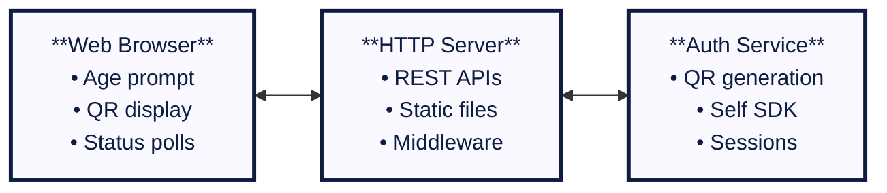

# Server Implementation

> **🎯 What you'll learn:** How to implement a production-ready age verification system by requesting and verifying verifiable credentials from a user's device.

This guide covers the technical implementation of an identity verification service from the backend's perspective. The process builds upon the principles of the **[authentication server implementation](../authentication/server-implementation.md)** but focuses on requesting and verifying specific claims from a user.

## Quick Start

Experience the complete age verification workflow with our **[production-ready age verifier](https://github.com/joinself/academy/blob/main/examples/solutions/age-verifier/)** example featuring:

- Full web interface with "I'm 18 or older" button workflow
- Date of birth credential requests and validation with zero-knowledge proofs
- Automatic age calculation and access control
- Privacy-preserving verification with minimal data exposure
- Real-time status updates and graceful error handling
- Production-ready architecture with logging and shutdown handling

**Try it now:**
```bash
cd examples/solutions/age-verifier
SELF_AUTH_STORAGE_KEY="$(openssl rand -base64 32)" go run cmd/server/main.go
# Open http://localhost:8081 and verify your age!
```

## Architecture Overview

The age verification system is built with a modular, production-ready architecture:



### Key Components

1. **HTTP Server**: Serves the web interface and provides REST API endpoints
2. **Auth Service**: Manages Self SDK interactions, sessions, and credential verification
3. **Web Interface**: Complete user experience with real-time updates
4. **Storage Layer**: Encrypted storage for account data and session management

## Core Workflow

The age verification process follows these phases:

### 1. User Declaration & QR Generation

When a user clicks "I'm 18 or older", the system generates a unique verification request:

<div data-github-embed="https://github.com/joinself/academy/blob/main/examples/solutions/age-verifier/internal/auth/service.go#L177-L210"
     data-style="github-dark-dimmed"
     data-show-border="true"
     data-show-line-numbers="true"
     data-show-file-meta="true"
     data-show-full-path="true"
     data-show-copy="true"></div>

### 2. Mobile Connection Handling

The system detects when a user scans the QR code and establishes a secure connection:

<div data-github-embed="https://github.com/joinself/academy/blob/main/examples/solutions/age-verifier/internal/auth/service.go#L399-L447"
     data-style="github-dark-dimmed"
     data-show-border="true"
     data-show-line-numbers="true"
     data-show-file-meta="true"
     data-show-full-path="true"
     data-show-copy="true"></div>

### 3. Requesting Date of Birth Credentials

After establishing a secure channel, the server sends a credential presentation request. The implementation uses **conditional disclosure** to verify age while minimizing data exposure:

<div data-github-embed="https://github.com/joinself/academy/blob/main/examples/solutions/age-verifier/internal/auth/service.go#L448-L490"
     data-style="github-dark-dimmed"
     data-show-border="true"
     data-show-line-numbers="true"
     data-show-file-meta="true"
     data-show-full-path="true"
     data-show-copy="true"></div>

**Key Features:**

- **Conditional Disclosure**: Uses `OperatorLessThan` to only share credentials if user meets age requirement
- **Privacy-Preserving**: Birth date is only revealed if verification passes
- **Automatic Issuance**: If user doesn't have a credential, Self SDK initiates document verification

### 4. Processing Credential Response & Age Verification

The system processes the credential response using a simple but powerful principle:

**If the user responds with credentials containing the required `dateOfBirth` claim, age verification passes. If no response is received or the claim is missing, verification fails.**

This works because the conditional disclosure request only returns a response if the user meets the age requirement (18+). The Self SDK handles the complex logic of:

- Checking if the user has a valid date of birth credential
- Verifying the birth date is before the cutoff date (18 years ago)
- Only returning the credential if the condition is met
- Automatically initiating document verification if no credential exists

The server simply needs to check if a response was received with the expected claim to determine if age verification succeeded.

## On-Demand Credential Issuance

Your application doesn't need to manage document verification. The Self SDK handles this automatically:

1. **Server requests** a credential containing `dateOfBirth`
2. **If credential doesn't exist**, Self SDK initiates document verification flow
3. **User captures document** with mobile camera
4. **Document is verified** by Self's secure services
5. **Verifiable credential issued** and stored on device
6. **Credential presented** to your server for verification

## Conditional Disclosure Verification

The age verification system implements privacy-preserving verification using conditional disclosure:

### Standard Conditional Disclosure Implementation

```go
// Calculate date 18 years ago
eighteenYearsAgo := time.Now().AddDate(-18, 0, 0).Format("2006-01-02")

// Request age verification with conditional disclosure
content, err := message.NewCredentialPresentationRequest().
    Type([]string{"VerifiablePresentation"}).
    Details(
        credential.CredentialTypePassport,
        []*message.CredentialPresentationDetailParameter{
            message.NewCredentialPresentationDetailParameter(
                message.OperatorLessThan,    // Birth date < cutoff date = over 18
                "dateOfBirth",
                eighteenYearsAgo,
            ),
        },
    ).
    Finish()
```

### Advanced Verification Patterns

```go
// Age range verification (18-65)
minimumAge := time.Now().AddDate(-65, 0, 0).Format("2006-01-02")
maximumAge := time.Now().AddDate(-18, 0, 0).Format("2006-01-02")

content, err := message.NewCredentialPresentationRequest().
    Details("DateOfBirthCredential", []*message.CredentialPresentationDetailParameter{
        // Must be older than 18
        message.NewCredentialPresentationDetailParameter(
            message.OperatorLessThan, "dateOfBirth", maximumAge,
        ),
        // Must be younger than 65
        message.NewCredentialPresentationDetailParameter(
            message.OperatorGreaterThan, "dateOfBirth", minimumAge,
        ),
    }).
    Finish()
```

**Privacy Benefits:**

- Birth date is only revealed if verification passes
- Reduces unnecessary data exposure
- Meets privacy regulations (GDPR, CCPA)
- Minimizes liability by limiting data access


## Next Steps

- **[Mobile Implementation](./mobile-implementation.md)**: See how the mobile app handles document capture and credential presentation
- **[Conclusions & Best Practices](./conclusions.md)**: Review production deployment strategies and security considerations
- **[Complete Example](https://github.com/joinself/academy/blob/main/examples/solutions/age-verifier/)**: Explore the full source code and implementation details
- **[Identity Verification Overview](../identity-verification.md)**: Return to the main identity verification guide 

