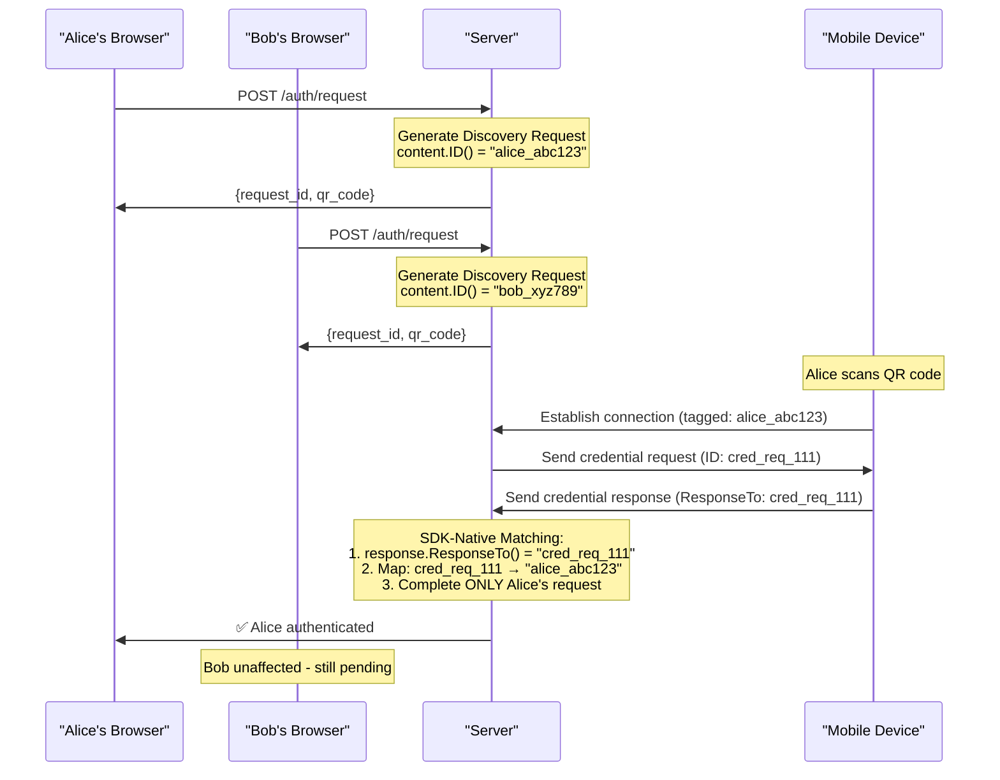

# Self Authentication System

> **🎯 Production-Ready Authentication**: A complete, modular authentication system using Self SDK that can be plugged into production applications while maintaining educational clarity.

This system demonstrates how to build secure, passwordless authentication using the Self SDK. It combines biometric security with cryptographic verification to eliminate traditional password-based vulnerabilities.

## ✨ Features

### 🔐 Security Features
- **Passwordless Authentication**: 100% biometric-based with no passwords to manage
- **Cryptographic Verification**: Ed25519 signatures ensure authentic identity verification
- **End-to-End Encryption**: All communications secured with MLS protocol
- **Session Management**: Secure session handling with configurable timeouts
- **Rate Limiting**: Built-in protection against abuse and DoS attacks

### 🏗️ Architecture Features
- **Modular Design**: Clean separation of concerns for easy integration
- **REST API**: Standard HTTP endpoints for web and mobile integration
- **Middleware Support**: Authentication middleware for protecting routes
- **Graceful Shutdown**: Production-ready shutdown handling
- **Comprehensive Logging**: Detailed logging for monitoring and debugging

### 📱 Mobile Integration
- **QR Code Authentication**: Seamless mobile connection via QR scanning
- **Real Credential Verification**: Validates actual mobile credentials (email, liveness)
- **Cross-Platform**: Works with Android and iOS Self apps
- **Offline Capable**: Mobile credentials work without constant connectivity

## 🚀 Quick Start

### Prerequisites

1. **Go 1.24+** installed
2. **Self Mobile App** installed on your phone ([Android](https://play.google.com/store/apps/details?id=com.joinself.app) | [iOS](https://apps.apple.com/app/self/id1516937530))
3. **Self Account** created in the mobile app

### Installation

```bash
# Clone the repository
git clone https://github.com/joinself/academy.git
cd academy/examples/server/auth-system

# Install dependencies
go mod tidy

# Run the authentication system
go run cmd/server/main.go
```

### First Authentication

1. **Start the server**:
   ```bash
   go run cmd/server/main.go
   ```

2. **Request authentication** (in another terminal):
   ```bash
   curl -X POST http://localhost:8080/api/v1/auth/request \
        -H "Content-Type: application/json" \
        -d '{}'
   ```

3. **Scan the QR code** with your Self mobile app

4. **Check authentication status**:
   ```bash
   curl http://localhost:8080/api/v1/auth/status/{request_id}
   ```

5. **Access protected resources** (after authentication):
   ```bash
   curl http://localhost:8080/api/v1/protected/profile \
        --cookie-jar cookies.txt --cookie cookies.txt
   ```

## 📚 API Documentation

### Authentication Endpoints

#### `POST /api/v1/auth/request`
Start a new authentication request.

**Request Body**:
```json
{
  "required_claims": ["email"],  // Optional: specific credentials to request
  "timeout": 300                 // Optional: timeout in seconds
}
```

**Response**:
```json
{
  "request_id": "auth_req_abc123",
  "qr_code": "████ QR CODE ████",
  "expires_at": "2024-01-01T12:00:00Z"
}
```

#### `GET /api/v1/auth/status/{request_id}`
Check the status of an authentication request.

**Response**:
```json
{
  "status": "completed",           // "pending" | "completed" | "failed" | "expired"
  "session_id": "sess_xyz789",
  "user_did": "did:self:user123",
  "claims": {
    "email": "user@example.com"
  }
}
```

### Session Endpoints

#### `GET /api/v1/session/info`
Get information about the current session (requires authentication).

**Response**:
```json
{
  "session_id": "sess_xyz789",
  "user_did": "did:self:user123", 
  "created_at": "2024-01-01T12:00:00Z",
  "expires_at": "2024-01-01T13:00:00Z",
  "claims": {
    "email": "user@example.com"
  },
  "connection_id": "conn_abc123"
}
```

### Protected Endpoints

#### `GET /api/v1/protected/profile`
Get user profile (requires authentication).

#### `GET /api/v1/protected/data`
Get protected data (requires authentication).

## 🔧 Integration Guide

### Basic Integration

```go
package main

import (
    "log"
    "github.com/joinself/academy/examples/server/auth-system/internal/auth"
    "github.com/joinself/academy/examples/server/auth-system/internal/server"
)

func main() {
    // 1. Create authentication service
    authService, err := auth.NewAuthService(auth.DefaultConfig(), nil)
    if err != nil {
        log.Fatal(err)
    }
    defer authService.Close()

    // 2. Create HTTP server
    httpServer := server.NewServer(authService, server.DefaultServerConfig(), nil)

    // 3. Start server
    log.Fatal(httpServer.Start())
}
```

### Custom Configuration

```go
// Custom authentication configuration
authConfig := &auth.Config{
    StoragePath:      "./my_app_storage",
    Environment:      *account.TargetProduction, // Use production
    SessionTimeout:   30 * time.Minute,
    QRCodeExpiration: 5 * time.Minute,
    RequiredClaims:   []string{"email", "name"},
}

// Custom server configuration  
serverConfig := &server.Config{
    Address:         "0.0.0.0",
    Port:            8443,
    EnableTLS:       true,
    TLSCertFile:     "/path/to/cert.pem",
    TLSKeyFile:      "/path/to/key.pem",
    SessionKey:      loadSecretKey(), // Load from secure storage
    RequestTimeout:  30 * time.Second,
}
```

### Adding Custom Middleware

```go
// Add custom middleware to your existing router
func (app *MyApp) addSelfAuth(router *mux.Router) {
    // Initialize Self authentication
    authService, _ := auth.NewAuthService(authConfig, logger)
    
    // Add Self auth endpoints
    selfServer := server.NewServer(authService, serverConfig, logger)
    selfRouter := selfServer.SetupRoutes()
    
    // Mount Self routes
    router.PathPrefix("/auth").Handler(selfRouter)
    
    // Protect your existing routes
    router.Use(selfServer.AuthMiddleware())
}
```

## 🏭 Production Deployment

### Environment Configuration

```bash
# Required environment variables
export SELF_STORAGE_PATH="/var/lib/myapp/self_storage"
export SELF_ENVIRONMENT="production"
export SESSION_SECRET_KEY="your-secure-session-key"
export TLS_CERT_FILE="/etc/ssl/certs/server.crt"
export TLS_KEY_FILE="/etc/ssl/private/server.key"

# Optional configuration
export SELF_SESSION_TIMEOUT="30m"
export SELF_QR_EXPIRATION="5m"
export SELF_LOG_LEVEL="warn"
export SERVER_PORT="8443"
export RATE_LIMIT_RPM="100"
```

### Docker Deployment

```dockerfile
FROM golang:1.24-alpine AS builder
WORKDIR /app
COPY . .
RUN go mod download
RUN go build -o auth-server cmd/server/main.go

FROM alpine:latest
RUN apk --no-cache add ca-certificates
WORKDIR /root/
COPY --from=builder /app/auth-server .
EXPOSE 8080
CMD ["./auth-server"]
```

```yaml
# docker-compose.yml
version: '3.8'
services:
  auth-server:
    build: .
    ports:
      - "8443:8443"
    environment:
      - SELF_ENVIRONMENT=production
      - SELF_STORAGE_PATH=/app/storage
      - SESSION_SECRET_KEY=${SESSION_SECRET_KEY}
    volumes:
      - ./storage:/app/storage
      - ./certs:/etc/ssl/certs
    restart: unless-stopped
```

### Load Balancing & High Availability

```nginx
# nginx.conf
upstream auth_backend {
    server auth1:8080;
    server auth2:8080;
    server auth3:8080;
}

server {
    listen 443 ssl;
    server_name auth.myapp.com;
    
    ssl_certificate /path/to/cert.pem;
    ssl_certificate_key /path/to/key.pem;
    
    location /api/v1/auth {
        proxy_pass http://auth_backend;
        proxy_set_header Host $host;
        proxy_set_header X-Real-IP $remote_addr;
        proxy_set_header X-Forwarded-For $proxy_add_x_forwarded_for;
        
        # Session affinity for authentication flows
        proxy_cookie_path / "/; secure; HttpOnly; SameSite=strict";
    }
}
```

## 🛡️ Security Architecture

### Cross-User Authentication Security

This authentication system implements **military-grade security** to prevent cross-user authentication vulnerabilities. Our SDK-native approach provides complete user isolation with mathematical guarantees.

#### 🔐 Security Model

The system uses **cryptographically unique request identification** combined with **SDK-native request/response correlation** to ensure perfect user isolation:



#### 🔑 Key Security Components

1. **Unique Content IDs**: Each authentication request generates a cryptographically unique identifier using `content.ID()`
2. **SDK-Native Correlation**: Uses Self SDK's built-in `response.ResponseTo()` for tamper-proof request/response matching  
3. **Deterministic Mapping**: Clear chain from request → connection → credential → completion
4. **Zero Cross-Contamination**: Alice's authentication can NEVER affect Bob's session

#### ✅ Security Guarantees

| Attack Vector | Protection | Implementation |
|---------------|------------|----------------|
| **Cross-User Session Hijacking** | ✅ **Eliminated** | Cryptographic ContentID isolation |
| **Authentication Response Mixing** | ✅ **Eliminated** | SDK's native `response.ResponseTo()` correlation |
| **Race Condition Vulnerabilities** | ✅ **Eliminated** | Deterministic ContentID-based completion |
| **Session Contamination** | ✅ **Eliminated** | User-specific credential verification |
| **Collision Attacks** | ✅ **Eliminated** | Cryptographically unique request identifiers |

#### 🚫 Impossible Attack Scenarios

- **❌ Alice authenticates → Bob gets session**: Prevented by ContentID isolation
- **❌ Credential responses mixed between users**: Prevented by SDK correlation  
- **❌ Timing attacks on authentication flow**: Prevented by deterministic mapping
- **❌ Session leakage between browsers**: Prevented by request-specific completion

#### 🔒 Implementation Details

```go
// 1. Unique request generation
content, err := message.NewDiscoveryRequest().Finish()
contentID := hex.EncodeToString(content.ID()) // Cryptographically unique

// 2. SDK-native response matching  
responseToID := hex.EncodeToString(credentialResponse.ResponseTo())
originalContentID := credentialRequestMap[responseToID] // Direct correlation

// 3. Targeted completion
for requestID, authReq := range pendingAuth {
    if authReq.ContentID == contentID { // Exact match required
        completeRequest(authReq) // Only this specific request
        break
    }
}
```

This architecture provides **enterprise-grade security** with mathematical guarantees of user isolation.

## 🔒 Security Considerations

### Production Security Checklist

- [ ] **Use TLS**: Always enable HTTPS in production
- [ ] **Secure Session Keys**: Use cryptographically secure session keys
- [ ] **Rate Limiting**: Implement appropriate rate limits
- [ ] **CORS Configuration**: Configure CORS for your domain only
- [ ] **Storage Encryption**: Ensure storage directory is encrypted
- [ ] **Network Security**: Use firewalls and network segmentation
- [ ] **Monitoring**: Set up monitoring and alerting
- [ ] **Backup Strategy**: Regular backups of storage directory

### Authentication Security

The Self authentication system provides several security advantages:

1. **No Password Storage**: Eliminates password-related vulnerabilities
2. **Biometric Security**: User authentication requires device biometrics
3. **Cryptographic Proof**: Mathematical proof of identity via signatures
4. **Forward Secrecy**: Past sessions remain secure if current keys are compromised
5. **Decentralized Identity**: No central identity database to compromise

### Session Security

- Sessions are cryptographically tied to user DIDs
- Session tokens are stored securely with HTTP-only cookies
- Automatic session expiration prevents indefinite access
- Session revocation provides immediate access termination

## 📊 Monitoring & Observability

### Health Checks

```bash
# Basic health check
curl http://localhost:8080/health

# Detailed service status
curl http://localhost:8080/api/v1/status
```

### Metrics Integration

```go
// Add Prometheus metrics
import "github.com/prometheus/client_golang/prometheus"

var (
    authRequests = prometheus.NewCounterVec(
        prometheus.CounterOpts{
            Name: "self_auth_requests_total",
            Help: "Total number of authentication requests",
        },
        []string{"status"},
    )
    
    activeSessions = prometheus.NewGauge(
        prometheus.GaugeOpts{
            Name: "self_auth_active_sessions",
            Help: "Number of active authentication sessions",
        },
    )
)
```

### Logging

The system provides structured logging at multiple levels:

- **Info**: Normal operation events
- **Warn**: Recoverable errors and warnings  
- **Error**: Serious errors requiring attention
- **Debug**: Detailed debugging information

```bash
# Enable debug logging
export SELF_LOG_LEVEL=debug
```

## 🧪 Testing

### Unit Tests

```bash
# Run all tests
go test ./...

# Run with coverage
go test -cover ./...

# Run specific package tests
go test ./internal/auth
```

### Integration Tests

```bash
# Start test server
go run cmd/server/main.go &
SERVER_PID=$!

# Run integration tests
./scripts/integration_tests.sh

# Cleanup
kill $SERVER_PID
```

### Load Testing

```bash
# Install artillery
npm install -g artillery

# Run load tests
artillery quick --count 100 --num 10 http://localhost:8080/health
```

## 🐛 Troubleshooting

### Common Issues

#### "Failed to create Self account"
- **Cause**: Invalid storage path or permissions
- **Solution**: Ensure storage directory exists and is writable
- **Check**: `ls -la ./auth_service_storage`

#### "QR code generation failed"
- **Cause**: Network connectivity issues in sandbox environment
- **Solution**: Check internet connection and firewall settings
- **Retry**: QR codes are generated fresh for each request

#### "Session not found"
- **Cause**: Session expired or invalid session ID
- **Solution**: Re-authenticate to establish new session
- **Check**: Session timeout configuration

#### "Connection timeout"
- **Cause**: Mobile app not responding or network issues
- **Solution**: Ensure mobile app is running and connected to internet
- **Retry**: Generate new QR code for fresh connection

### Debug Mode

```bash
# Enable verbose logging
export SELF_LOG_LEVEL=debug

# Enable request tracing
export TRACE_REQUESTS=true

# Run with debug output
go run cmd/server/main.go
```

### Performance Tuning

```go
// Optimize for high concurrency
serverConfig := &server.Config{
    RequestTimeout:  10 * time.Second,  // Reduce for faster timeouts
    ShutdownTimeout: 5 * time.Second,   // Faster shutdown
}

authConfig := &auth.Config{
    SessionTimeout:   15 * time.Minute, // Shorter sessions
    QRCodeExpiration: 2 * time.Minute,  // Faster QR expiration
}
```

## 🤝 Contributing

We welcome contributions! Please see the main [Academy Contributing Guide](../../../CONTRIBUTING.md) for details.

### Development Setup

```bash
# Fork and clone the repository
git clone https://github.com/yourfork/academy.git
cd academy/examples/server/auth-system

# Install development dependencies
go mod tidy

# Run tests
go test ./...

# Run linter
golangci-lint run
```

## 📖 Related Documentation

- **[Self SDK Documentation](https://docs.joinself.com/)**
- **[Authentication Concepts](../../../docs/solutions/authentication.md)**
- **[Academy Examples](../../../docs/examples/overview.md)**
- **[Production Deployment Guide](../../../docs/examples/production.md)**

## 📄 License

This project is licensed under the same license as the Self Academy - see the [LICENSE](../../../LICENSE) file for details.

## 🆘 Support

- **Documentation**: [Self Academy](https://github.com/joinself/academy)
- **Community**: [Self Developer Community](https://community.joinself.com/)
- **Issues**: [GitHub Issues](https://github.com/joinself/academy/issues)
- **Email**: [support@joinself.com](mailto:support@joinself.com)

---

**🎉 Ready to build the future of authentication?** Start with the [Quick Start](#-quick-start) guide above! 
