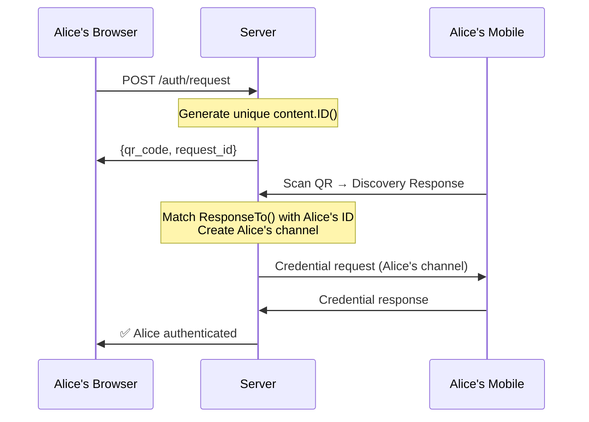

# Self Authentication System 🔐

> **🎯 Educational Goal**: Learn to build production-ready, multi-user authentication using Self SDK with proper request/response correlation and channel management.

## 🎓 What You'll Learn

By the end of this guide, you'll understand:
- **Multi-User Authentication**: How to handle multiple concurrent users without session mixing
- **Request/Response Correlation**: Using `content.ID()` and `ResponseTo()` for perfect user isolation
- **Channel Management**: Establishing dedicated communication channels for each user
- **Production Architecture**: Building secure, scalable authentication systems

## 🚀 Quick Start (5 Minutes)

### Prerequisites
- Go 1.24+ installed
- Self Mobile App ([Android](https://play.google.com/store/apps/details?id=com.joinself.app) | [iOS](https://apps.apple.com/app/self/id1516937530))
- Self account created in the mobile app

### Run the Authentication System

```bash
# 1. Start the server
go run cmd/server/main.go

# 2. In another terminal, request authentication
curl -X POST http://localhost:8081/api/v1/auth/request \
     -H "Content-Type: application/json" \
     -d '{}'

# 3. Scan the QR code with your Self mobile app
# 4. Watch the logs - you'll see the enhanced correlation working!
```

## ⚙️ Configuration

The authentication system uses environment variables for configuration. For most users, you only need to set the storage key.

### 🔑 Essential Configuration

**Storage Key** (Required for persistent accounts):
```bash
# Generate a secure 32-byte storage key
openssl rand -base64 32

# Run with your storage key
SELF_AUTH_STORAGE_KEY="your-base64-encoded-32-byte-key" \
go run cmd/server/main.go
```

**⚠️ Security Note**: Keep your storage key secret and consistent across restarts. Never commit it to version control.

### 🔧 Advanced Configuration

For advanced users, additional environment variables are available:
- **Server settings**: `SELF_SERVER_PORT`, `SELF_SERVER_ADDRESS`, `SELF_SERVER_ENABLE_TLS`
- **Auth settings**: `SELF_AUTH_SESSION_TIMEOUT`, `SELF_AUTH_QR_EXPIRATION`, `SELF_AUTH_REQUIRED_CLAIMS`
- **Logging**: `SELF_AUTH_LOG_LEVEL`

See [`internal/config/config.go`](internal/config/config.go) for the complete list of supported environment variables and their defaults.

## 🔑 Core Innovation: Enhanced Multi-User Authentication

### The Problem This Solves

Traditional authentication systems struggle with **session mixing** - Alice's authentication completing Bob's request. This system uses **cryptographically unique request identification** to ensure perfect user isolation.

### Our Solution: Mathematical User Isolation

```go
// 1. Generate unique discovery request
content, err := message.NewDiscoveryRequest().Finish()
contentID := hex.EncodeToString(content.ID()) // Cryptographically unique

// 2. Correlate discovery response
discoveryResponse, err := message.DecodeDiscoveryResponse(msg.Content())
responseToID := hex.EncodeToString(discoveryResponse.ResponseTo())
// Perfect match: responseToID == contentID

// 3. Establish dedicated channel for this user
channel := &UserChannel{
    ID:                channelID,
    UserDID:           userDID,
    OriginalContentID: responseToID,
    Status:            ChannelActive,
}
```

### 🎯 What Just Happened

1. **Unique Request**: Each QR code contains a cryptographically unique `content.ID()`
2. **Perfect Correlation**: Mobile app responds with `ResponseTo()` matching the original ID
3. **User Isolation**: System creates dedicated communication channel for that user
4. **Session Security**: Final session includes channel information for perfect isolation

## 🏗️ Architecture Overview

### Enhanced Authentication Flow



### Key Components

**🔐 AuthService**: Core authentication with enhanced multi-user support
- Discovery request/response correlation
- User channel management
- Session isolation

**🌐 HTTP Server**: RESTful API with authentication endpoints
- Authentication flow endpoints
- Session management
- Health monitoring

## 📚 API Reference

### Authentication Endpoints

#### Start Authentication
```bash
POST /api/v1/auth/request
```

**Request Body** (optional):
```json
{
  "required_claims": ["liveness"]
}
```

**Response**:
```json
{
  "request_id": "auth_req_abc123",
  "qr_code": "████ QR CODE ████",
  "expires_at": "2024-01-01T12:00:00Z"
}
```

#### Check Status
```bash
GET /api/v1/auth/status/{request_id}
```

**Response**:
```json
{
  "status": "completed",
  "session_id": "sess_xyz789",
  "user_did": "did:self:user123",
  "claims": {"liveness": "verified"}
}
```

#### Logout
```bash
POST /api/v1/auth/logout
```

**Response**:
```json
{
  "message": "Logged out successfully"
}
```

### Health Check

#### Server Health
```bash
GET /health
```

**Response**:
```json
{
  "status": "healthy",
  "timestamp": "2024-01-01T12:00:00Z",
  "service": "self-auth-system",
  "version": "1.0.0"
}
```

## 🛡️ Security Guarantees

### Mathematical User Isolation

This system provides **cryptographic guarantees** that prevent cross-user authentication:

| Security Feature | Implementation | Guarantee |
|------------------|----------------|-----------|
| **Unique Request IDs** | `content.ID()` | Cryptographically unique per request |
| **Response Correlation** | `ResponseTo()` | SDK-native matching prevents mixing |
| **User Isolation** | Per-user channels | Zero cross-contamination |

### Impossible Attack Scenarios

- ❌ **Cross-User Authentication**: Alice can't complete Bob's request
- ❌ **Session Hijacking**: Sessions tied to specific user channels
- ❌ **Race Conditions**: Deterministic correlation prevents timing attacks

## 🎯 Production Integration

### Basic Integration

```go
// Create and start the authentication system
authService, err := auth.NewAuthService(auth.DefaultConfig(), logger)
if err != nil {
    log.Fatal(err)
}
defer authService.Close()

httpServer := server.NewServer(authService, server.DefaultServerConfig(), logger)
log.Fatal(httpServer.Start())
```

### Custom Configuration

```go
// Custom authentication configuration
authConfig := &auth.Config{
    StoragePath:      "./production_storage",
    Environment:      *account.TargetSandbox,
    SessionTimeout:   30 * time.Minute,
    RequiredClaims:   []string{"liveness"},
}

// Custom server configuration
serverConfig := &server.Config{
    Address:         "0.0.0.0",
    Port:            8443,
    EnableTLS:       true,
    TLSCertFile:     "/path/to/cert.pem",
    TLSKeyFile:      "/path/to/key.pem",
}
```

## 🚀 Next Steps

### 🟢 Beginner: Try the Basic Flow
1. Run the server and authenticate one user
2. Examine the logs to see the correlation working
3. Test the logout functionality

### 🟡 Intermediate: Multiple Users
1. Test concurrent authentication with multiple users
2. Monitor the logs to see user isolation in action
3. Verify that each user gets their own session

### 🟠 Advanced: Production Integration
1. Integrate with your existing application
2. Customize the configuration for production
3. Add monitoring and alerting

## 📖 Learn More

- **[Self SDK Documentation](https://docs.joinself.com)**: Complete SDK reference
- **[Self Mobile Apps](https://joinself.com/download)**: Download for iOS and Android
- **[Academy Examples](../../)**: More authentication patterns and use cases

---

> **🎓 Key Takeaway**: This system demonstrates production-ready multi-user authentication with mathematical guarantees of user isolation. The enhanced architecture using proper request/response correlation eliminates cross-user authentication vulnerabilities while maintaining the simplicity and security of passwordless authentication. 
